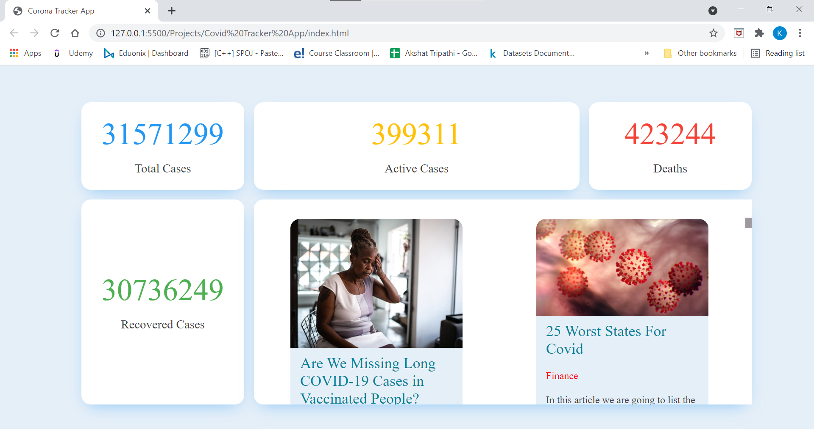

# Covid-Tracker-App-using-API

## Overview of the Application

> _A simple API enabled website build using HTML, CSS & JavaScript._

Covid Tracker App will show the following information, total active cases, total cases till now, total recovered cases, total death cases and at last latest news related to Covid.

## Tech Stack

**Client:** HTML, CSS , JavaScript

**API:** 

For Covid Data: https://openweathermap.org/

For News : https://covid-19-news.p.rapidapi.com/v1/covid?q=covid&lang=en&media=True

## ScreenShot

## Live Demo

<video width="320" height="240" controls >
  <source src="movie.mp4" type="./Assets/media/Corona Tracker App.mp4" >
</video>
