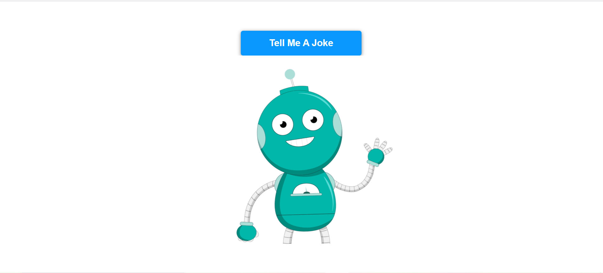

# Joke Telling Robot

## About the Project
It is a simple jaavscript which uses web speech api for telling a joke and for randomly creating a joke, another joke api used.

Jokes are based on <b>programming</b>  category.

## Tech Stacks Used

## API Used

https://official-joke-api.appspot.com/jokes/programming/random

## Screenshots

## Live Demo
