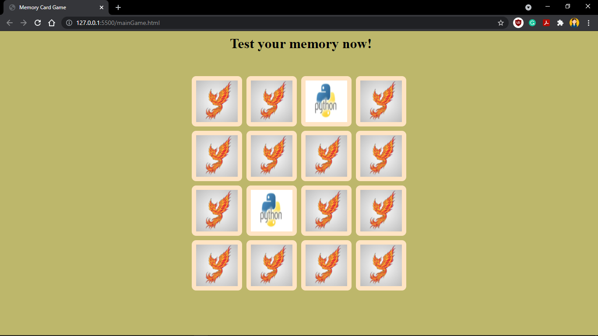
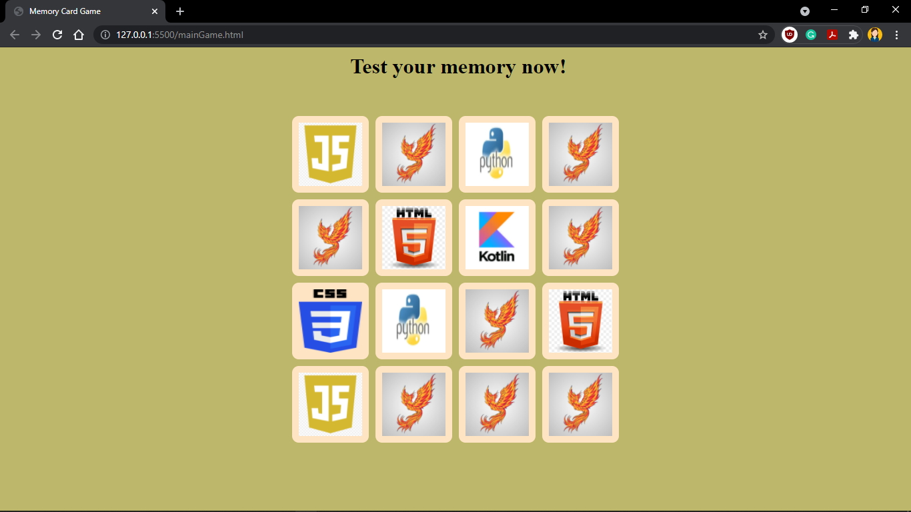
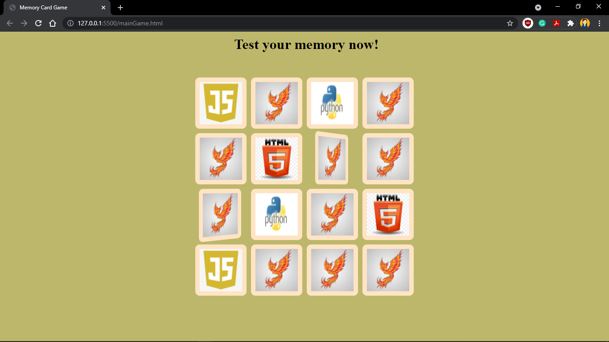

# Memory Card Game
A basic memory game in which the trick is to remember which cards are where.

# Stack Used
- HTML5
- CSS3
- JavaScript

# Set up required to run
1. Clone the repository.
```
git clone https://github.com/LetsGrowMoreCommunity/WebDev-Playyard.git
```
2. Move to project directory.

3. Open mainGame.html with Chrome or any browser.

4. Start Playing.

# Screenshots
- When a player turns over two cards that match, those cards get fixed.


- When a player turns over two cards that do not match, those cards are turned face down again (in the same position).


