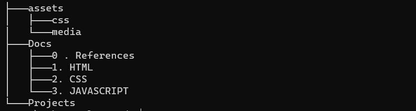

<h1 align="center" >💻 WEBDEV - PLAYYARD 💻</h1>

<h3>Hello Everyone 👋🏻 Glad to see you all here !! I hope everyone is eager to give their best contributions. This project aims to collected mini project realted to front-end web development at a single place.Not only Projects but also aim to collect documents ( notes ) & provide references for beginners to learn it.

<h1 align="center"> Technologies Included </h1>

  

<h1 align="center">Project Structure 📌</h1>

<ul>
<li>In assets folder ( root directory ) we will be having css files & media file of Main website.</li>
<li>In Docs Folder we will be adding Notes in of Technologies in its respective folder. Check Docs folder for more details.</li>
<li>In Project Folder we will be adding all mini projects which can be hosted on GitHub Pages.Check Project Folder for more details.</li>
<li>In root directory we are also having 2 more files `index.html` & `script.js` these files will be used for hosting main website on github pages.
</ul>

<h1 align="center">🛠️ Workflow 🛠️</h1>
<ul>
<li>Check Contribution Guidelines</li>
<li>Check for Open ( Unassigned ) Issue, If you are able to do the particular task then ask for assignment ( Help will be provided by mentors to get the task done if you stuck at some place )</li>
<li>Start work only on the issue which are assigned to you</li>
<li>After Completion of work Open a Pull Request with template provided.</li>
<li>Mentor will review it and let you know if any changes required and get it merged.</li>
<li>If you want to create issue for addition of project or notes feel free to open <strong>Don't forget to ask for assignment while opening issue.</strong></li>
<li>Do Follow Code of Conduct.</li>
<li>Happy Coding 💻</li>
</ul>

<h1 align="center">Contribution Guidelines</h1>

#### Check [Contribution Guidelines](contributionGuidelines.md)

In this file you will get how to setup the whole project and also how to create issue and how to get your contribution done.

<h1 align="center">Project Maintainers ⛑️</h1>

| Aman Kesarwani                                                     | Vilsi Jain                                               | Hemu Choudhary                                                 | Sushant Srivastav                                            | Rohan Kulkarni                                                     |
| ------------------------------------------------------------------ | -------------------------------------------------------- | -------------------------------------------------------------- | ------------------------------------------------------------ | ------------------------------------------------------------------ |
|  |  |  |  |  |

<h1 align="center">Project Mentors ⛑️</h1>

| Sneha Agarwal                                                     | Ujjawal Sharma                                           |
| ----------------------------------------------------------------- | -------------------------------------------------------  |
|  |   |

 

<h1 align="center">Made with ❤️ By Developers</h1>
